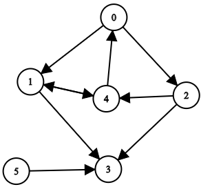

# Graph


A Graph data structure

This library provides a minimal implementation of a directed/weighted graph data structure. Internally, an adjacency list is used to represent nodes and edges.

## Description: [Wiki](https://en.wikipedia.org/wiki/Graph_(discrete_mathematics))
A **graph** is a structure amounting to a set of objects in which some pairs of the objects are in some sense "related". There are two main parts of a graph:

- The **nodes** (vertices) where the data is stored i.e. the numbers in the image
- The **edges** (connections) which connect the nodes i.e. the lines between the numbers in the image



Graphs can be **directed** or **undirected**

- Directed graph: The relationships are based on the direction of the edges. It can be a one way relationship or a two-way relationship, but it must be explicitly stated.
- Undirected graph: The relationship exists in both directions. Can be represented via directed graph.

### Traversing a graph
- Breadth first search: [Wiki](https://en.wikipedia.org/wiki/Breadth-first_search)
- Depth first search: [Wiki](https://en.wikipedia.org/wiki/Depth-first_search)

### Algorithms
- Mother Node in a Graph: [Info](https://www.geeksforgeeks.org/find-a-mother-vertex-in-a-graph/)
- Number of paths between nodes: [Info](https://www.geeksforgeeks.org/count-possible-paths-two-vertices/)
- Is cyclic: [Info](https://www.geeksforgeeks.org/detect-cycle-in-a-graph/)

## How to Build

```
mkdir ./build
cd ./build
cmake ..
make -j <job count>
```

### Code Examples
- [Basic Usage](./examples/Basic.cxx)
- [Iterators](./examples/Iterator.cxx)
- [Mother Node](./examples/MotherNode.cxx)
- [Number of paths](./examples/NumOfPaths.cxx)
- [Is cyclic](./examples/IsCyclic.cxx)

### Running Examples
```
cd build/examples
./<example_name>
```

## License

This project is licensed under the MIT License - see the [LICENSE](LICENSE) file for details
